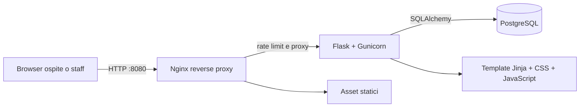

# Gabriel's Hotel

> Piattaforma di prenotazione alberghiera in Flask, pronta per demo locali, portfolio GitHub e sviluppo verso un MVP commerciale.


Gabriel's Hotel è una web application per piccoli hotel, boutique hotel e strutture ricettive indipendenti. Gli ospiti possono creare un account, consultare le camere, filtrare disponibilità e capienza, prenotare un soggiorno e gestire le proprie prenotazioni. Admin e staff hanno permessi separati per amministrare camere, utenti e prenotazioni.

L'interfaccia punta a un'immagine premium: layout responsive, fotografie d'atmosfera, tipografia elegante, micro-interazioni e call to action orientate alla conversione.

## Indice

- [Panoramica](#panoramica)
- [Funzionalità](#funzionalità)
- [Tecnologie](#tecnologie)
- [Struttura del progetto](#struttura-del-progetto)
- [Prerequisiti](#prerequisiti)
- [Configurazione](#configurazione)
- [Avvio locale](#avvio-locale)
- [Account demo](#account-demo)
- [Stripe e pagamenti](#stripe-e-pagamenti)
- [Email e recupero password](#email-e-recupero-password)
- [Sicurezza](#sicurezza)
- [Roadmap commerciale](#roadmap-commerciale)
- [Comandi utili](#comandi-utili)

## Panoramica



```text
Ospite
  |
  v
Landing page -> Registrazione/Login -> Date e numero ospiti
  |
  v
Filtro camere + calendario selezionato
  |
  v
Stripe Checkout oppure conferma demo locale
  |
  v
Dashboard personale
```

## Funzionalità

### Area ospite

- Homepage commerciale con camere, prezzi e call to action.
- Registrazione e login con password salvate come hash non reversibile.
- Conferma password e visualizzazione temporanea dell'ultimo carattere digitato.
- Recupero password tramite link monouso a scadenza.
- La password precedente viene sostituita quando il reset va a buon fine.
- Ricerca soggiorno per data di arrivo, data di partenza e numero ospiti.
- Filtro server-side delle camere per disponibilità e capienza.
- Calendario della camera selezionata con giorni disponibili e occupati.
- Pagamento con Stripe Checkout in test mode oppure conferma demo locale.
- Controllo della capienza della camera.
- Blocco delle prenotazioni sovrapposte.
- Dashboard con storico, stato delle prenotazioni e annullamento.
- Email di recupero password tramite SMTP/Brevo oppure link disponibile nei log in sviluppo.

### Area staff e admin

- Ruoli separati: `admin`, `staff` e ospite.
- L'admin può creare, disabilitare, riattivare o cancellare utenze staff.
- Lo staff può creare e aggiornare camere, senza poter annullare prenotazioni.
- L'annullamento delle prenotazioni è riservato all'admin.
- Elenco globale delle prenotazioni con ospite, camera, date e stato.
- Upload immagini camere con validazione del tipo reale di file.

### Profilo personale

- Modifica di nome ed email.
- Cambio password inserendo la nuova password e la relativa conferma.
- La password attuale non è mai visualizzabile né richiesta nella gestione profilo.
- Gli account staff disabilitati non possono accedere e le sessioni successive vengono invalidate.

## Tecnologie

| Livello | Tecnologia | Scopo |
| --- | --- | --- |
| Backend | Python 3.12 + Flask | Routing, autenticazione e logica applicativa |
| Server WSGI | Gunicorn | Esecuzione applicativa in container |
| Database | PostgreSQL 16 | Utenti, camere e prenotazioni |
| ORM | Flask-SQLAlchemy | Accesso al database |
| Form | Flask-WTF | Validazione e protezione CSRF |
| Sessioni | Flask-Login | Login e controllo accessi |
| Proxy | Nginx | Reverse proxy, rate limiting e timeout |
| Pagamenti | Stripe Checkout | Pagamenti online senza gestire dati carta |
| Email | SMTP / Brevo | Invio link di reset password |
| Immagini | Pillow + asset locali | Validazione upload e immagini demo |
| Frontend | HTML, CSS, JavaScript | UI responsive e interazioni |
| Font | Google Fonts | Playfair Display e DM Sans |
| Container | Docker Compose | Avvio locale riproducibile |

## Struttura del progetto

```text
TestWebSiteProject/
|-- app.py                 # Applicazione Flask, modelli e route
|-- requirements.txt       # Dipendenze Python bloccate
|-- Dockerfile             # Immagine Flask/Gunicorn non-root
|-- docker-entrypoint.sh   # Permessi volume upload e avvio applicazione
|-- docker-compose.yml     # Servizi web, database e Nginx
|-- nginx/
|   `-- nginx.conf         # Proxy e protezioni HTTP
|-- templates/             # Template Jinja
|   |-- base.html
|   |-- index.html
|   |-- auth.html
|   |-- book.html
|   |-- dashboard.html
|   |-- profile.html
|   |-- room_form.html
|   |-- staff_form.html
|   `-- admin.html
|-- static/
|   |-- style.css          # Design system e responsive UI
|   |-- admin.css          # Admin, staff e profilo
|   |-- booking.css        # Filtro camere e calendario selezionato
|   |-- app.js             # Reveal, filtri e micro-interazioni
|   `-- rooms/             # Immagini locali demo delle camere
|-- .env.example           # Modello di configurazione
|-- .env                   # Configurazione locale, esclusa da Git
|-- .dockerignore          # File esclusi dal build context
`-- README.md
```

## Prerequisiti

Per eseguire il progetto in locale basta avere Docker installato e avviato.

- Docker Desktop per Windows, macOS e Linux: [download Docker Desktop](https://www.docker.com/products/docker-desktop/)
- Docker Engine per distribuzioni Linux server: [guida ufficiale Docker Engine](https://docs.docker.com/engine/install/)
- Documentazione di Docker Compose: [Docker Compose docs](https://docs.docker.com/compose/)

## Configurazione

Il file `.env` contiene segreti, credenziali locali e impostazioni caricate da Docker Compose e Flask. Non deve essere pubblicato su GitHub, inserito nell'immagine Docker o condiviso in chat.

Per configurare il progetto:

1. Duplica o rinomina `.env.example` in `.env`.
2. Apri `.env` e aggiorna almeno `SECRET_KEY`, `POSTGRES_PASSWORD`, `DATABASE_URL`, `ADMIN_PASSWORD`, `STAFF_PASSWORD` e `DEMO_USER_PASSWORD`.
3. Lascia vuote le chiavi Stripe se vuoi usare la modalità demo locale.
4. Compila le variabili `MAIL_*` solo se vuoi testare l'invio email reale.

Se il file `.env` locale esiste già, non serve ricrearlo: controlla che contenga tutte le variabili presenti in `.env.example` e aggiorna solo i valori necessari.

Esempio di configurazione locale:

```env
SECRET_KEY=replace-with-a-long-random-value
POSTGRES_DB=hotel
POSTGRES_USER=hotel
POSTGRES_PASSWORD=change-this-password
DATABASE_URL=postgresql+psycopg://hotel:change-this-password@db:5432/hotel

ADMIN_EMAIL=admin@gabriels-hotel.local
# Password iniziale per creare l'admin demo; nel database viene salvato solo l'hash
ADMIN_PASSWORD=change-this-admin-password
STAFF_EMAIL=staff@gabriels-hotel.local
# Password iniziale per creare lo staff demo; nel database viene salvato solo l'hash
STAFF_PASSWORD=change-this-staff-password
DEMO_USER_EMAIL=ospite@gabriels-hotel.local
# Password iniziale per creare l'ospite demo; nel database viene salvato solo l'hash
DEMO_USER_PASSWORD=change-this-guest-password

TRUSTED_HOSTS=localhost,127.0.0.1
COOKIE_SECURE=0

STRIPE_SECRET_KEY=
STRIPE_PUBLISHABLE_KEY=

MAIL_SERVER=
MAIL_PORT=587
MAIL_USERNAME=
MAIL_PASSWORD=
MAIL_USE_TLS=1
MAIL_FROM=noreply@dominio-verificato.example
```

Nota: `POSTGRES_PASSWORD` e la password dentro `DATABASE_URL` devono combaciare.

`STRIPE_SECRET_KEY` vuota abilita la modalità demo. Per Stripe Test usa una chiave `sk_test_...`; non inserire mai chiavi reali in GitHub.

## Avvio locale

Apri un terminale nella cartella del progetto e avvia i container:

```sh
docker compose up -d --build
```

Quando i servizi sono pronti, apri:

[http://localhost:8080](http://localhost:8080)

Per verificare lo stato:

```sh
docker compose ps
```

Se vuoi ricostruire tutto in modo pulito, ad esempio dopo modifiche alle dipendenze o all'immagine Docker:

```sh
docker compose down --remove-orphans
docker compose build --no-cache --pull
docker compose up -d
docker compose ps
```

## Account demo

Al primo avvio vengono creati automaticamente gli account demo configurati nel file `.env`.

Per provare subito l'app puoi usare credenziali fittizie come queste, inserendole nel tuo `.env`:

| Ruolo | Email | Password | Cosa puoi testare |
| --- | --- | --- | --- |
| Admin | `admin@gabriels-hotel.local` | `AdminTest_2026_GabrielsHotel` | Camere, utenti staff, prenotazioni e annullamenti |
| Staff | `staff@gabriels-hotel.local` | `StaffTest_2026_GabrielsHotel` | Creazione e modifica camere |
| Ospite | `ospite@gabriels-hotel.local` | `GuestTest_2026_GabrielsHotel` | Profilo, disponibilità, prenotazione e dashboard |

Le email e le password corrispondono rispettivamente alle variabili `ADMIN_EMAIL`, `ADMIN_PASSWORD`, `STAFF_EMAIL`, `STAFF_PASSWORD`, `DEMO_USER_EMAIL` e `DEMO_USER_PASSWORD`.

Queste password demo servono solo come input iniziale per creare gli account. Nel database l'app salva soltanto l'hash della password, non la password in chiaro.

Per ricreare database e account demo da zero:

```sh
docker compose down -v
docker compose up -d --build
```

Attenzione: `docker compose down -v` elimina anche il volume locale di PostgreSQL.

Per provare il percorso ospite puoi usare direttamente l'account demo oppure creare un nuovo account dalla pagina **Inizia**.

## Stripe e pagamenti

Se `STRIPE_SECRET_KEY` e `STRIPE_PUBLISHABLE_KEY` sono vuote, l'app conferma le prenotazioni in modalità demo locale.

Per testare Stripe Checkout:

1. Crea o usa un account Stripe.
2. Recupera le chiavi di test.
3. Inserisci nel file `.env` una chiave `sk_test_...` e la relativa publishable key.
4. Riavvia i container.

In test mode puoi usare la carta `4242 4242 4242 4242`, una scadenza futura e un CVC qualsiasi, ad esempio `123`.

I pagamenti vengono verificati server-side tramite la sessione Checkout. Le carte non vengono mai memorizzate dall'applicazione.

## Email e recupero password

Il progetto supporta SMTP e funziona bene con Brevo.

Configurazione Brevo:

1. Crea un account su [Brevo](https://www.brevo.com/).
2. Verifica l'indirizzo email o il dominio mittente.
3. Crea una SMTP key dalla sezione SMTP/API.
4. Aggiorna il file `.env`:

```env
MAIL_SERVER=smtp-relay.brevo.com
MAIL_PORT=587
MAIL_USERNAME=la-tua-email-brevo
MAIL_PASSWORD=la-tua-smtp-key-brevo
MAIL_USE_TLS=1
MAIL_FROM=mittente-verificato@tuodominio.it
```

Se SMTP non è configurato, il link di reset password viene scritto nei log del container `web`, utile durante lo sviluppo.

```sh
docker compose logs -f web
```

Per usare il recupero password: apri **Accedi**, seleziona **Hai dimenticato la password?**, inserisci l'email e apri il link ricevuto. Se SMTP non è configurato, recupera il link dai log del container `web`.

Se il server SMTP rifiuta l'invio, l'errore viene registrato nei log senza generare una pagina 500.

## Sicurezza

- Nginx davanti a Gunicorn con rate limiting globale e limiti più severi sulle route sensibili.
- CSRF su tutti i form mutanti.
- Password salvate come hash `scrypt` con salt tramite Werkzeug; non sono recuperabili o decifrabili.
- Cookie `HttpOnly` e `SameSite`.
- Content Security Policy, `X-Frame-Options`, `X-Content-Type-Options` e `Referrer-Policy`.
- Container Flask eseguito con utente non-root.
- Validazione server-side di date, capienza e sovrapposizione prenotazioni.
- Verifica server-side della sessione Stripe prima della conferma pagamento.
- Token reset password salvati solo come hash, monouso e con scadenza.
- Upload immagini limitato e validato con Pillow.
- `.env` escluso da Git tramite `.gitignore` e dal contesto Docker tramite `.dockerignore`.

Per un rilascio pubblico servono anche HTTPS, backup, monitoraggio, gestione errori, protezione DDoS e policy privacy/cookie aggiornate.

## Roadmap commerciale

Questa base è adatta a una demo commerciale o a un MVP. Per trasformarla in un prodotto vendibile aggiungerei:

1. HTTPS automatico con certificato valido.
2. Database gestito con backup automatici.
3. Email transazionali per conferme, modifiche e annullamenti.
4. Webhook Stripe firmato, ricevute e gestione rimborsi.
5. Gestione multi-hotel, camere multiple e listini stagionali.
6. Pannello calendario più avanzato per disponibilità e prezzi.
7. Audit log, test automatici e monitoraggio applicativo.
8. CDN/WAF e rate limiting distribuito.
9. Privacy policy, cookie policy e conformità GDPR.

## Comandi utili

```sh
# Stato dei container
docker compose ps

# Log applicazione Flask
docker compose logs -f web

# Log di tutti i servizi
docker compose logs -f

# Stop mantenendo i dati locali
docker compose down

# Stop cancellando anche il database locale
docker compose down -v
```
